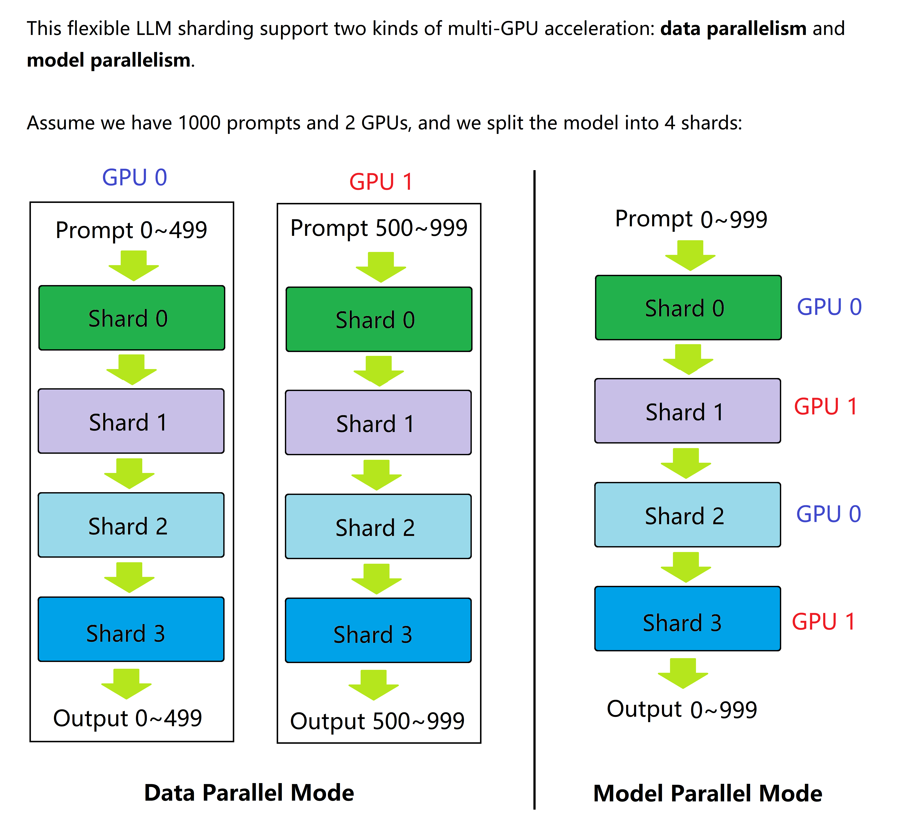

# flexible-LLM-sharding
This repository is designed for individuals who want to run LLM locally with small vRAM (GPU memory) and RAM. It facilitates the efficient execution of unquantized LLM's (such as LLaMA2-70B) with vRAM&ge;6GB and RAM&ge;8GB, i.e. when standard offloading does not work.

Traditional offloading methods have increasing vRAM requirements with increasing model size. For example, for 70B model loaded in float16 dtype it takes ~130GB. Standard Offloading Methods would require the total of vRAM and RAM to be bigger than this value. Assume the RAM is 64 GB, then it needs two A100 40GB which may not be availalbe for all NLPers. In contrast, Flexible-LLM-Sharding simplifies the process, enabling seamless execution of 70B-parameter models on GPUs with only 6GB of vRAM. This not only breaks barriers but also emphasizes the critical significance of minimal vRAM requirements.

**Basic Usage**

To use flexible LLM sharding, first you will need to download and convert Hugging Face model checkpoints into layerwise weight files by running prepare_weights.py script. An example notebook splitting Llama2-7B model could be found [here](https://www.kaggle.com/code/junxhuang/split-llama2-7b-weights).

Then you could run LLM with flexible sharding by
```bash
git clone https://github.com/Robot-Eyes/flexible-LLM-sharding.git

python flexible-LLM-sharding/main.py --layer_num_per_shard 1 --storage_location cpu --num_batch 1 \
                                    --model_path ./llama2_checkpoints \
                                    --prompt_pickle input_prompts.pkl --output_file output_score.pkl

```

* **Layer Sharding Control**: Define the number of layers combined into a shard, offering granular customization for different GPU situation. The option _--layer_num_per_shard_ controls how many layers should fit into one GPU as a shard. The more layers in a shard, the more vRAM it requires. Setting to 1 will minimize vRAM usage.

* **Adaptive Activation Storage**: Opt for RAM, vRAM, or disk for intermediate activation storage. This provides extra control over memory utilization, ensuring optimal speed and performance. The option _--storage_location_ controls where to store the intermediate activations. It could be 'cpu' (store in RAM), 'gpu' (store in vRAM), or 'disk' (write files to a folder you choose).
  
* **Multi-GPU Flexibility**: Unleash the power of multiple GPUs, you could either use data parallelism or model parallelism (see figure below). By default we use model parallel. The flag _--data_parallel_ will let multiple GPUs run with data parallel, i.e. each GPU loads the whole model and works on a portion of the prompts.
  

* The options _--prompt_pickle_ and _--output_file_ specific the pickle file that has the input prompts, and the output pickle file of the scores.

* The option _--model_path_ is where the layer-wise weights are.

A sample demo for a Kaggle competition could be found in [this notebook](https://www.kaggle.com/junxhuang/running-llm-with-flexible-sharding-technique), which shows that flexible-LLM-sharding technique has much lower vRAM requirement (6GB for 70B model) and faster inference speed than standard offloading.
